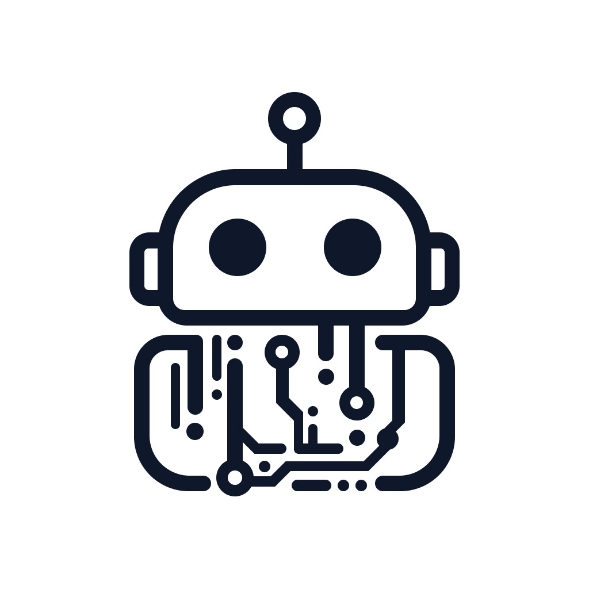

<div  align="center">
      
</div>

# UNICO Discord Bot

UNICO Discord Bot is designed to integrate UNICO's agents with Discord. This bot allows users to interact with their agents directly from their Discord server, streamlining access to UNICO features without leaving the Discord platform.

## Getting Started (Development)

- **Install [nvm](https://www.freecodecamp.org/news/node-version-manager-nvm-install-guide/)** (node version manager):

- **Use the same node version from the `.nvmrc` file**:
  - For Windows:
    ```sh
    nvm use $(Get-Content .nvmrc)
    ```
  - For Other Systems:
    ```sh
    nvm use
    ```
- **Install the necessary packages**:

  ```sh
  npm install
  ```

- **Rename `.env.example` to `.env`** then replace the content with your keys

  ```bash
  cp .env.example .env
  ```

- **Information needed in the `.env` file**

  - **DISCORD_BOT_TOKEN**: Discord token of the bot from [the discord developer portal](https://discord.com/developers/).
  - **DISCORD_SERVER_ID**: Your Discord Server ID.
  - **DISCORD_APPLICATION_ID**: The Discord Application ID from [the discord developer portal](https://discord.com/developers/) in the app page of your bot.
  - **DISCORD_STAFF_TICKET_CHANNEL**: The ID of the channel where you want to send the ticket to.
  - **DISCORD_MOD_ROLE_ID**: The ID of the moderator role. This role can clear messages from all the channels.
  - **UNICO_API_KEY**: Your UNICO Api Key.
  - **UNICO_BASE_URL** (Only if you want to test the bot in staging mode): If not specified the bot will point to production
  - **UNICO_TICKET_AGENT_ID**: The id of the support agent created in your UNICO dashboard.
  - **UNICO_SUMMARIZER_AGENT_ID**: The id of the summarizer agent created in your UNICO dashboard.
  - **DISCORD_BASE_USER_ROLE_ID**: The id of the role you want all new users to have.
  - **DISCORD_WELCOME_CHANNEL_ID**: The id of the channel where you want the welcome message be sended.

- **Execute the bot**: `nodemon` package will be used to restart the application when code changes.
  ```bash
  npm run dev
  ```

## Before pushing

**See if you have any rebase to do** (you must have the updated commits history before pushing to avoid conflicts
between main and your branch):

```sh
git fetch
git pull origin main --rebase
```

## Contributing

If you want to contribute to **UNICO Discord Bot**, follow these steps:

1. Create a new branch for your changes (`git checkout -b your-branch-name`).
2. Make your changes and commit them (`git commit -m 'Changed something'`).
3. Push your branch (`git push origin your-branch-name`).
4. Open a pull request.

## Contact

For more information, contact the **UNICO** support team at: info@theunico.it
